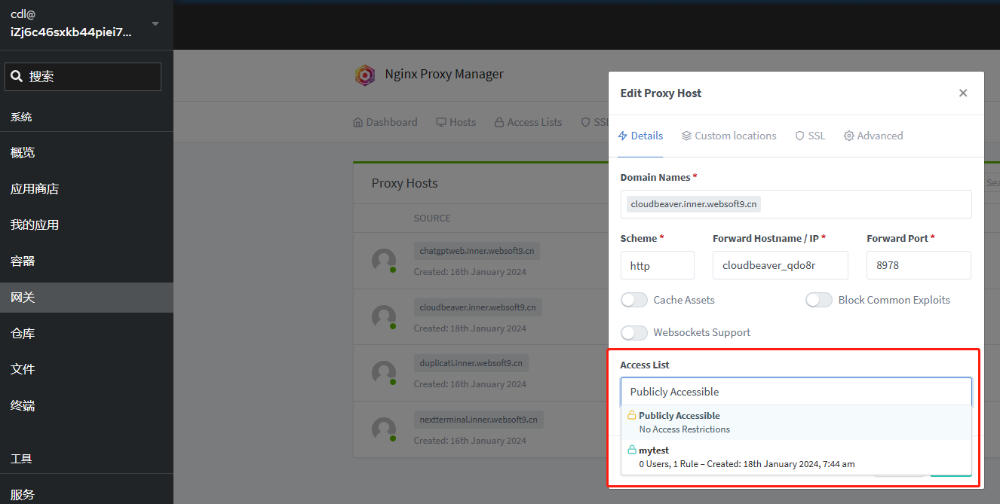

# 设置应用的安全访问控制

Websoft9 网关模块基于 Nginx HTTP Basic Authentication 和  Nginx HTTP Access 来管理和控制对应用的访问。

## 关于

应用访问控制是网络安全的重要组成部分，它有助于确保只有授权用户能够访问敏感数据和功能。以下它的核心价值：

1. **数据保护**：防止未授权的用户访问敏感信息，从而保护这些信息不被泄露或滥用。

2. **合规性要求**：许多行业都有法规要求企业保护客户数据和隐私，例如欧盟的 GDPR。访问控制有助于企业遵守这些法规。

4. **避免内部威胁**：内部用户（如员工）也可能因为恶意意图或意外操作而导致安全事件。访问控制做出限制。

5. **环境隔离**：在开发、测试和生产环境之间实施访问控制可以防止代码或数据的未经授权的复制，从而减少潜在的错误和安全问题。

6. **审计和监控**：访问控制系统通常能够记录用户的活动，这有助于监控和审计安全事件，以及在发生安全事件时进行事后分析。

7. **减少攻击面**：通过限制对特定应用程序和服务的访问，可以减少攻击者可以利用的潜在入口点，从而降低系统受到攻击的可能性。

8. **用户体验**：通过为不同类型的用户提供定制化的访问权限，可以提高用户体验，因为用户只会看到他们需要的功能和数据。


## 设置白名单访问控制{#allow}

Websoft9 的网关具备为此类应用设置密码或白名单访问，具体步骤如下：

1. Websoft9 控制台进入 **网关** 功能模块，打开：**Access Lists** 设置项

2. 点击 **New Access List**，新增一个访问控制项

   - Details: 输入英文名称
   - Authorization：输入账号密码
   - Access：allow 处输入可以访问的[白名单](https://nginx.org/en/docs/http/ngx_http_access_module.html#allow)，0.0.0.0/ 表示允许所有 IP 访问

## 设置账号密码访问控制{#user}

参考上一步：[设置白名单访问控制](#allow)

## 启用 Proxy Host 的访问控制

1. Websoft9 控制台进入 **网关** 功能模块，编辑目标 **Proxy Host**

2. 在 **Details** 标签页中，为 **Access List** 选择一个已经配置的选项
   

## 设置客户端并发请求数{#conns}

当网站遭遇 DDoS 攻击或爬虫过度抓取，并发出突然增高直至网站资源耗尽。针对这种情况，除了部署 WAF 产品做出防护之外，可以通过 Websoft9 网关配置客户端请求相关的参数：

1. Websoft9 控制台进入 **网关** 功能模块，编辑目标 **Proxy Host**

2. 在 **Advanced** 标签页中，增加下面的配置即可（全局请求控制与单个 IP 请求控制）
   ```
   # 在 server 块中使用 limit_req 和 limit_conn
   limit_req zone=w9_global_limit burst=500 nodelay; 
   limit_req zone=w9_limit_req_zone burst=300 nodelay;
   limit_conn w9_limit_conn_zone 30;
   ```

   > limit_req 和 limit_conn 通过网关的 `/data/nginx/custom/http.conf` 文件进行定义

## 问题
