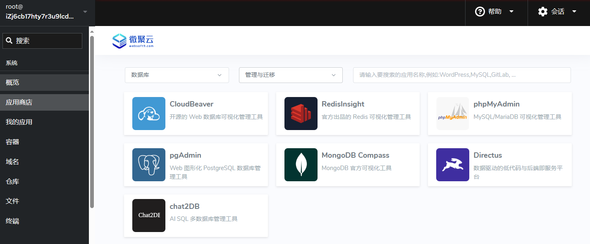
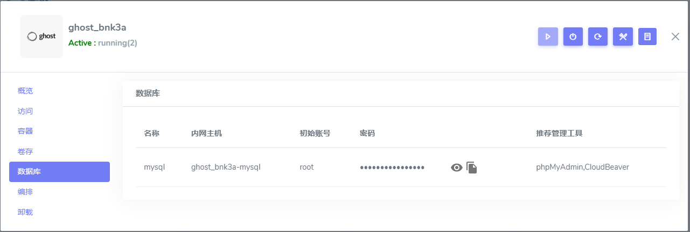

# 连接并管理应用的数据库

Websoft9 采用微服务架构部署应用，每个应用的数据库都进行了必要的预配置，且它们是独立运行的，应用间数据互不干扰。  

为了安全考虑，数据库容器的端口没有绑定在宿主机上，通过本地客户端连接数据库是不推荐的，也是障碍重重的。      

但是，通过 Websoft9 应用商店安装 [phpMyAdmin](./phpmyadmin), [pgAdmin](./pgadmin) 等可视化 Web 工具来以内网的方式管理数据库，既安全又简单。  

## 条件

在线连接并管理数据库的所需的两个要素：

- 安装 Web 数据库管理工具
- 获取准确的数据库**内网**连接信息（主机名，账号，密码，端口等）

## 数据库连接信息对照（表）{#table}

下面列出常见的数据库系统账号、端口与管理工具对应表，供您参考：

| 数据库          | 管理员   | 端口  | Web 版管理工具          |
| --------------- | -------- | ----- | ----------------------- |
| MySQL           | root     | 3306  | phpMyadmin, CloudBeaver |
| MariaDB         | root     | 3306  | phpMyadmin, CloudBeaver |
| PostgreSQL      | postgres | 5432  | pgAdmin, CloudBeaver    |
| SQL Server      | sa       | 1433  | CloudBeaver             |
| MongoDB         | root     | 27017 | MongoDB Compass           |
| Oracle Database | system   | 1521  | CloudBeaver             |
| Redis           | 空       | 6379  | RedisInsight            |

## 启动数据库管理工具

Websoft9 托管平台遵循 "一切皆应用、一切皆组装" 的技术哲学，赋予用户选择数据库管理工具的自由，并提供便利的方式。   

1. 登录 Websoft9 控制台，进入应用商店模块中的 "数据库" > "管理与迁移" 子类目
   

2. 安装所需的 Web 版数据库管理工具

## 获取数据库连接信息

1. 登录 Websoft9 控制台，进入我的应用功能模块后，进入目标应用的管理界面

2. 点击 "数据库" 标签页，即可查看数据库的内网主机和账号等信息
   
   - 名称：数据库类型，例如 MySQL, PostgreSQL 等
   - 内网主机：用于内网连接的数据库主机名称

   

## 连接数据库

### 在线连接数据库

参考主要的数据库管理工具相关的操作文档：  

- [phpMyAdmin](./phpmyadmin)
- [pgAdmin](./pgAdmin)
- [CloudBeaver](./cloudbeaver)

### 本地客户端连接数据库

尽管我们通常不建议直接从本地客户端连接到远程数据库，但以下是我们为此目的提供的参考方案，请按需谨慎使用。

下面以 MySQL 为例进行任务说明：

1. 对应用进行重新编排并重建应用，确保 MySQL 容器的 3306 端口已经绑定到宿主机

3. 本地客户端使用宿主机的 IP 和 端口连接 MySQL 

