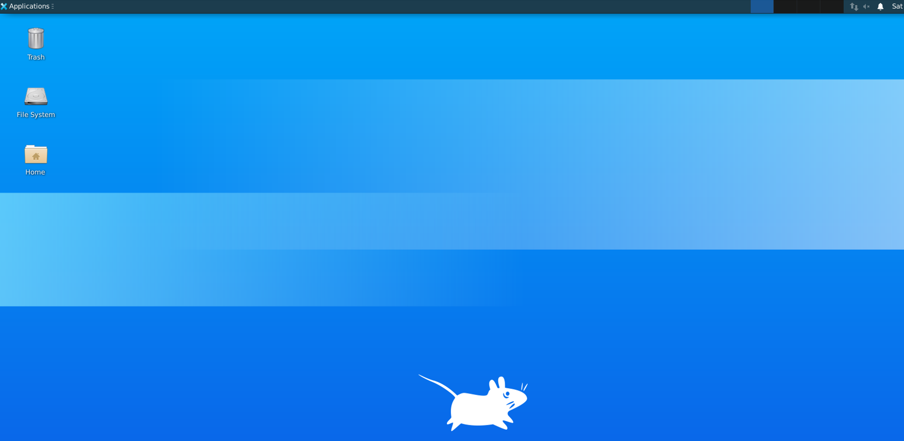
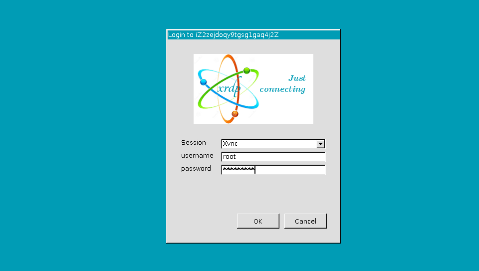
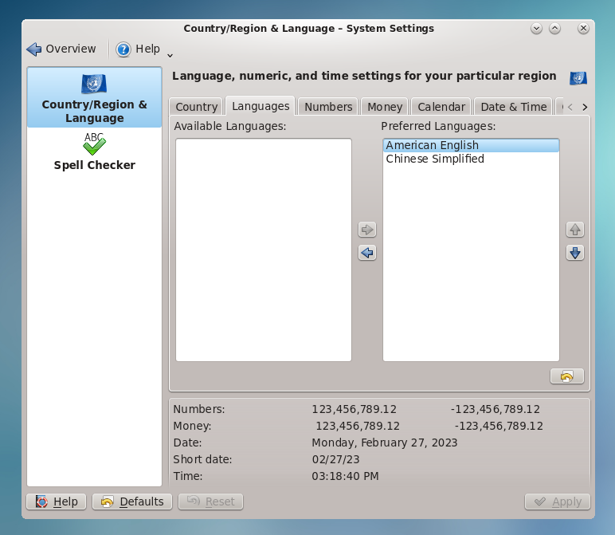

import Tabs from '@theme/Tabs';
import TabItem from '@theme/TabItem';

# Linux

Websoft9 为企业用户提供个性化的 Linux 系统托管技术支持服务，满足用户 DevOps 以及应用托管的特殊需求场景。  

## 系统支持

目前支持个性化的操作系统包括：

- 纯净版的操作系统，例如：[Oracle Linux](https://market.aliyun.com/products?k=websoft9+oracle+linux&scene=market), Rocky Linux, CentOS7.x
- 含桌面的操作系统，例如：[Oracle Linux with Gnome](https://market.aliyun.com/products?k=oracle+linux+websoft9+gnome&scene=market)
- 含软件包的操作系统，例如：Ubuntu with Docker, Ubuntu with AI 大模型

### Oracle Linux

[Oracle Linux](https://www.oracle.com/linux/) 是一个完全免费、开源并可以自由分发的 Linux 发行版。它与其他免费 Linux 相比，有几个特别之处：

1. 更兼容 Oracle 的其他产品线，例如：[Why Oracle Database Runs Best on Oracle Linux](https://www.oracle.com/a/ocom/docs/linux/oracle-database-runs-best-on-oracle-linux.pdf)

2. 修复补丁后无需重启（零停机）

3. Oracle Linux 官方提供了比较完善的配套支持：
   * [Oracle Linux 认证应用程序](https://apexapps.oracle.com/pls/apex/f?p=10263:17::::::)
   * [Oracle Linux 硬件兼容商](https://linux.oracle.com/ords/f?p=117:1)
   * [Oracle Linux CVE](https://linux.oracle.com/ords/f?p=130:21:)
   * [Oracle Linux 升级包](https://linux.oracle.com/ords/f?p=105:21:117077190823888:pg_R_1213672130548773998:NO&pg_min_row=1&pg_max_rows=50&pg_rows_fetched=50)
   * [Oracle Linux 勘误表](https://oss.oracle.com/mailman/listinfo/el-errata)

4. Oracle 官方提供了可选的[技术支持订阅](https://shop.oracle.com/apex/f?p=dstore:2:0::NO:RIR,RP,2:PROD_HIER_ID:4510272175861805728468)

5. Oracle 在云上提供了一个 Oracle Autonomous Linux 系统，具备自主更新升级的能力（零停机）

6. Oracle Linux 内核 [Unbreakable Enterprise Kernel](https://github.com/oracle/linux-uek)，兼容 RHCK

7. Oracle Linux 在一个维护周期内会发布多个安全漏洞和 Bug 补丁，更可靠的**升级流程** 

   1. 订阅 Oracle 官方的[补丁通知邮件](https://www.oracle.com/cn/security-alerts/)：注册免费 Oracle 账号 > 用户控制面板 > 订阅管理 > Oracle 安全通知
   2. 选择一种升级方案：
      - 普通升级方案：[Linux 标准的软件包升级方案](https://docs.oracle.com/en/operating-systems/oracle-linux/software-management/sfw-mgmt-UpdateSoftwareonOracleLinux.html#update-software)  
      - 不停机升级方案：Oracle 官方提供的升级工具[Ksplice](https://ksplice.oracle.com/try/trial) 


### CentOS7.x

CentOS7.x 是一个已经官方停止支持的操作系统发行版，Websoft9 当前为它继续提供支持。

## 桌面支持{#desktop}

Websoft9 在云平台上提供的 Linux 桌面，为企业用户提供了一个高效、安全、可靠且灵活的虚拟工作空间，助力企业提升工作效率，确保数据安全，降低运营成本。   

无论是日常办公、软件开发还是数据分析，Websoft9 的 Linux 云桌面解决方案都能满足企业的多样化需求。   

<Tabs>
  <TabItem value="Gnome" label="Gnome" default>
    
  </TabItem>
  <TabItem value="kde" label="KDE">
    
  </TabItem>
  <TabItem value="mate" label="Mate">
    
  </TabItem>
  <TabItem value="Xfce" label="Xfce">
    
  </TabItem>
</Tabs>

### 准备

使用桌面之前，需要准备如下事项：  

* 创建可登陆的用户：必须使用 `adduser` 创建

* 开启服务器安全组端口
  - XRDP 连接端口： 3389
  - VNC 连接端口：5901

* SSH 登录到服务器，设置 VNC 密码（仅适用 VNC 连接需要）
   ```
   vncpasswd
   systemctl restart vnc
   ```
* 与桌面有关的服务

    ```
    # For RDP
    sudo systemctl start | stop | restart | status xrdp

    # For Gnome
    sudo systemctl start | stop | restart | status gdm

    # For VNC
    sudo systemctl start | stop | restart | status vncserver
    ```
* 默认的 VNC 服务器： [TigerVNC](https://github.com/TigerVNC/tigervnc)

### 连接桌面

连接 Linux 桌面主要有两种方式：XRDP 和 VNC 模式，推荐使用 [XRDP](https://cloudzy.com/rdp-vs-vnc-remote-desktop-comparison/)

|         | 速度 | 实现原理     | 多用户           | 平台                           | 安全协议   |
| ------- | ---- | ------------ | ---------------- | ------------------------------ | ---------- |
| **RDP** | 效率高，速度快 | 计算资源共享，本地渲染 | 继承操作系统用户 | Linux, Windows, macOS, Android | SSL/TLS    |
| **VNC** | 效率底，速度慢 | 屏幕共享 ，服务端渲染    | 没有用户         | Linux, Windows, macOS          | SSH tunnel |


#### XRDP 连接（推荐）

本地电脑如果是 Windows 系统，那么可以使用系统自带的远程桌面客户端去连接 Linux 桌面：  

1. 打开 开始菜单，输入”mstsc“ ，系统会搜索远程桌面连接工具  

2. 输入 **服务器公网IP** ，点击【连接】  
   
   
   > 确保云控制台中服务器安全组 3389 端口是开启状态
  
3. 如果出现下面的提示，点击【是】继续  
   
  
4. XRDP 对话框中，输入服务器 root 账号和密码
  
 
   > 建议采用普通用户登录 Linux 桌面，而不是 root 用户。请参照下面命令创建普通用户：
    ```
    sudo su 
    adduser xxxuser # 根据提示完成密码设置
    ```

5. 成功登录后，就可以看到 Linux 桌面

6. 以 Gnome 为例，打开：【Setting】>【Region&Lanuage】>【Language】设置中文（重启后生效）
  


#### VNC 连接

VNC 是一种传统的连接 Linux 服务器桌面的方式：  

1. 使用 SSH 登录 Linux 桌面所在的服务器，设置你的 VNC 服务端访问密码
    ```
    sudo su
    rm -rf /root/.vnc/passwd
    vncpasswd
    ```
2. 本地电脑安装 [VNC viewer](https://www.realvnc.com/download/viewer/) 客户端

3. 登录云服务器控制台，为你的云服务器安全组中开启 **5901** 端口

4. 本地电脑打开 VNC 客户端，创建一个VNC连接（服务器公网IP地址：5901）
   

5. 点击【Continue】进入下一步
   

6. 输入VNC密码后登录即可进入图形化界面
   
   
   
   

7. 如果服务器处于下图所示的锁定状态，请输入你的**服务器的密码**进行解锁
   


8. VCN 使用过程中可参考如下命令进行维护  
   ```
   # 查看已经运行的桌面编号
   vncserver -list

   # 终止2号桌面进程
   kill -9 :1

   # 管理桌面服务
   systemctl start vncserver@:1.service
   systemctl stop vncserver@:1.service
   systemctl status vncserver@:1.service
   systemctl restart vncserver@:1.service
   ```

### 设置桌面语言

设置 Linux 桌面为中文一般分三个步骤，安装语言包、安装字体(防乱码)和设置区域和语言，下面以 CentOS KDE 桌面为例演示：

1. 查询系统支持语言包并安装语言包
   ```
   yum search kde | grep -i chinese
   yum install kde-l10n-Chinese.noarch
   ```

2. 安装字体
   ```
   yum groupinstall "fonts"
   ```

3. 远程登录 KDE 桌面，设置语言: [system settings] - [Commone Appearance and Behavior] - [Local] - [Languages]

   

### 安装 Web 浏览器

Linux 桌面安装 Google Chrome 为例：

```
# For CentOS7
wget https://dl.google.com/linux/direct/google-chrome-stable_current_x86_64.rpm
sudo yum localinstall google-chrome-stable_current_x86_64.rpm
/usr/bin/google-chrome --no-sandbox

# For Ubuntu
wget https://dl.google.com/linux/direct/google-chrome-stable_current_amd64.deb
sudo apt install ./google-chrome-stable_current_amd64.deb
vim /usr/bin/google-chrome/google-chrome
exec -a "$0" "$HERE/chrome" "$@"  修改为 exec -a "$0" "$HERE/chrome" "$@" --no-sandbox
rm -r ~/.config/google-chrome
```

## 常用操作

### 启用 root 账号密码{#enable}

如果云平台默认没有开放 Linux 系统的 `root` 账号，那么请参考下面的步骤启用它：

1. 通过云控制台的 Web 版 SSH 工具连接服务器

2. 运行下面的命令为 root 账号设置密码
    ```
    sudo su
    sudo passwd root
    ```

3. 编辑 */etc/ssh/sshd_config* 文件和 */etc/ssh/sshd_config.d* 目录的下的配置文件，确保最终为 sshd 服务端提供了准确的配置：

   1. 增加的配置项：`PermitRootLogin yes` 和 `PasswordAuthentication yes`
   2. 删除的配置项：`PermitRootLogin no` 和 `PasswordAuthentication no`

3. 重启 sshd 服务后生效
   ```
   sudo systemctl restart sshd
   ```

### 编码与字体

编码与字体两者都是为字符服务，但有本质差异：

- 编码是计算机存储各种文字的格式（UTF8，Unicode等），是**面向机器**的设计形式，运行 `locale` 命令查看编码
- 字体是计算机将字符显示出来的格式（中文黑体、 Google Fonts），是**面向人类**的设计形式

## 相关参考

- [Linux 命令](./linux-commands)
- [Linux 使用容器](./guide/container/)

## 故障排除{#troubleshoot}

#### CPU 100% 导致系统重启？

如果 CPU 100% 负荷持续一段时间，系统可能会自动重启，其实这是 Linux 的一种设计。原因是 Linux 系统中有一个叫 [WatchDog](https://linux.die.net/man/8/watchdog) 的程序在起作用。但监测到系统异常且预计无法自愈，则只能触发重启机制以解决问题。  

```
The Linux kernel can reset the system if serious problems are detected. This can be implemented via special watchdog hardware, or via a slightly less reliable software-only watchdog inside the kernel.
```

重启是果，CPU 100% 是根本原因。当然，也可以修改 WatchDog 的配置以降低它通过重启解决问题的权重。  

#### IO 密集型计算下服务器重启？ 

问题描述：数据库建索引等 IO 密集型计算负载下或资源耗尽 CPU 100%，服务器出现重启的情况？  
解决方案：Oracle 官方建议及时升级补丁

#### 磁盘已满，需要清理？

1. 查看文件的占用大小情况
   ```
   # 查看当前目录下各文件、文件夹的大小
   du -h –max-depth=1 *

   # 查询当前目录总大小
   du -sh

   # 显示直接子目录文件及文件夹大小统计值
   du -h –max-depth=0 *
   ```

2. 根据查询结果进行对应的删除

#### 服务器连不上？

下图显示了无法连接云服务器的主要原因分类及出现概率，按照对应的原因进行排查：  


#### 远程桌面报错：“由于安全设置错误，客户端无法连接到远程计算机...”  

原因：本地远程桌面客户端与服务端协议不匹配      
方案：需根据实际情况修正


#### 桌面锁屏了怎么办？

登录密码无法解锁，只能重启服务器后再登录。建议登录桌面后，关闭锁屏功能。

以 Gnome 为例，关闭步骤：【Privacy】>【Screen Lock】，将【Automatic Screen Lock】设置为 off