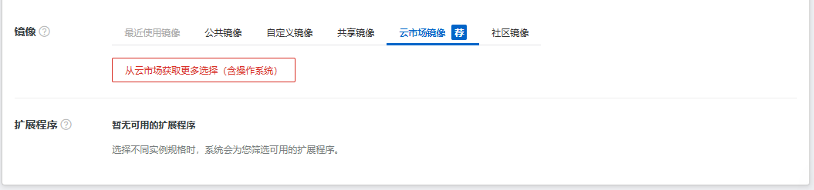
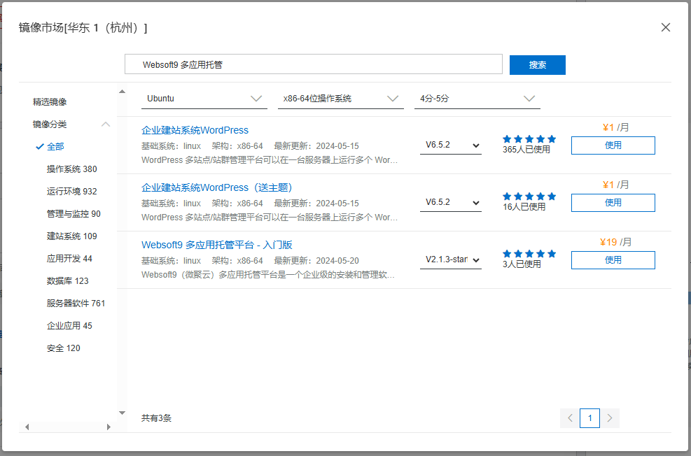

# 阿里云

Websoft9 在阿里云和 Alibaba Cloud 都提供了预制镜像，用户可以通过购买的方式实现自动化安装部署 Websoft9 多应用托管平台。  

- [Websoft9 on 阿里云](https://shop658hlt17.market.aliyun.com)
- [Websoft9 on AlibabaCloud](https://shop658hlt17.market.aliyun.com)

## 先决条件

必须拥有阿里云的账号：

- 如果你或你的公司已经有一个订阅帐户，请使用该帐户
- 如果没有，可以免费[开设自己的阿里云帐户](https://free.aliyun.com/)，免费使用 100+ 多种云产品

## 规划虚拟机配置

先阅读 [Websoft9 安装要求](./requirements)，了解所需的服务器规格、存储和带宽要求。 

另外，在 阿里云 上部署 Websoft9 时，需要填写重要的配置参数，下面先提前说明：

- 操作系统磁盘类型，请选择 **SSD** 相关类型
- 安全组端口开启：80, 443, 9000
- 身份验证：密钥对

## 安装 Websoft9

一旦您注册了阿里云的账号，您可以通过如下多种方式安装我们的产品：

### 基于云市场安装

1. 访问 [Websoft9 云市场店铺](https://shop658hlt17.market.aliyun.com/)，找到所需安装的商品

2. 进入产品详情页后点击 "立即购买" 按钮

3. 根据向导提示，完成服务器购买过程，包括：选择计费方式、实例类型、网络和安全组等设置

4. 等待几分钟，ECS 创建完成后，镜像会作为 ECS 实例的系统盘启动，即镜像自动部署到实例中

### 基于控制台安装

控制台**创建 ECS** 或**更换系统盘**时，均可设置 Websoft9 镜像作为系统盘，从而实现安装。

1. 阿里云控制台，进入 ECS 管理界面

   - 创建一个新的 ECS
   - 或对目标 ECS 进行 "更换系统盘" 操作

2. 在镜像来源设置中，选择：镜像市场 > 从镜像市场获取更多选择（含操作系统）
   

3. 然后搜索关键件词 “websoft9 托管平台”，选择对应的镜像
   

4. 根据向导提示，完成服务器购买过程，包括：选择计费方式、实例类型、网络和安全组等设置

5. 等待几分钟，ECS 创建完成后，镜像会作为 ECS 实例的系统盘启动，即镜像自动部署到实例中

### 基于计算巢安装

即将推出

### 基于 API/CLI 安装

即将推出

### 基于 ROS 安装

1. 提前准备部署模板

2. 登录阿里云控制台，将部署模板导入运行

## 完成虚拟机部署

选用以上任意安装方式，阿里云都会开始部署新的 ECS。  

部署过程需要几分钟才能完成。完成后，通过阿里云的控制台查看新的 ECS 的信息。  

## 后续配置 Websoft9

ECS 可用之后，还需要[完成配置域名等后续操作](./setup)，方可使用更好的使用 Websoft9