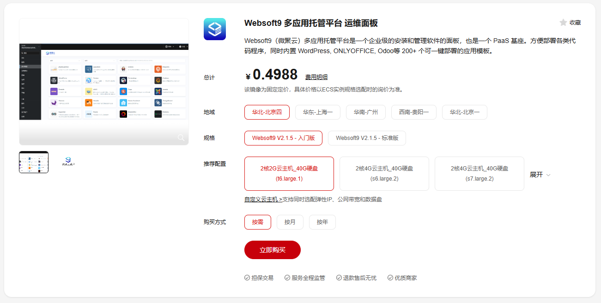

# 华为云

Websoft9 在华为云和 HUAWEICLOUD 都提供了预制镜像，用户可以通过购买的方式实现自动化安装部署 Websoft9 多应用托管平台。  

- [Websoft9 on 华为云](https://marketplace.huaweicloud.com/contents/29458a42-64b7-4637-aa7c-8bfddea1fb72)
- [Websoft9 on HUAWEICLOUD](https://marketplace.huaweicloud.com/intl/contents/bf4480ae-d0af-422c-b246-e2ec67743f4e)

## 先决条件

必须拥有华为云的账号：

- 如果你或你的公司已经有一个订阅帐户，请使用该帐户
- 如果没有，可以免费[开设自己的华为云帐户](https://activity.huaweicloud.com/free_test/index.html)，免费使用 100+ 多种云产品

## 规划虚拟机配置

先阅读 [Websoft9 安装要求](./install-requirements)，了解所需的服务器规格、SSD 存储和带宽要求。 

## 安装 Websoft9

一旦您注册了华为云的账号，您可以通过如下多种方式安装我们的产品：

### 基于云市场安装

1. 本地浏览器访问华为云上的 [Websoft9 多应用托管平台](https://marketplace.huaweicloud.com/contents/29458a42-64b7-4637-aa7c-8bfddea1fb72) 产品页

2. 进入产品详情页后，点击 **立即购买** 或 **自定义云主机** 按钮
   

3. 根据向导提示，完成服务器购买过程，包括：选择计费方式、实例类型、网络和安全组等设置

4. 等待几分钟，ECS 创建完成后，镜像会作为 ECS 实例的系统盘启动，即镜像自动部署到实例中

### 基于控制台安装

控制台**创建 ECS** 或**切换操作系统**时，均可设置 Websoft9 镜像作为系统盘，从而实现安装。

1. 华为云控制台，进入 ECS 管理界面

   - 购买 ECS
   - 或对目标 ECS 进行 **切换操作系统** 操作

2. 在镜像来源设置中，选择 **市场镜像**

3. 然后搜索关键件词 **websoft9 托管平台**，选择对应的镜像

4. 根据向导提示，完成服务器购买过程，包括：选择计费方式、实例类型、网络和安全组等设置

5. 等待几分钟，ECS 创建完成后，镜像会作为 ECS 实例的系统盘启动，即镜像自动部署到实例中

### 基于 API/CLI 安装

基于 API/CLI 安装的核心基础是提前获取 Websoft9 镜像ID，然后再运行自己的 API 或 CLI 命令。

下面提供获取 Websoft9 镜像 ID 的方法：

1. 登录华为云 [API Explorer](https://console.huaweicloud.com/apiexplorer) 查询特定目标区域镜像 ID，查询条件：

   - name: `websoft9-basic-Ubuntu22.04` or `websoft9-standard-Ubuntu22.04`
   - __imagetype: `market`
   - Region: 需选择一个[可用区域](https://marketplace.huaweicloud.com/contents/29458a42-64b7-4637-aa7c-8bfddea1fb72)

2. 查询结果中 **ID** 即镜像 ID

### 基于资源编排安装

1. 提前准备部署模板

2. 登录华为云控制台，将部署模板导入运行

## 完成虚拟机部署

选用以上任意安装方式，华为云都会开始部署新的 ECS。  

部署过程需要几分钟才能完成。完成后，通过华为云的控制台查看新的 ECS 的信息。  

## 后续配置 Websoft9

ECS 可用之后，还需要[完成配置域名等后续操作](./domain-set)，方可使用更好的使用 Websoft9
