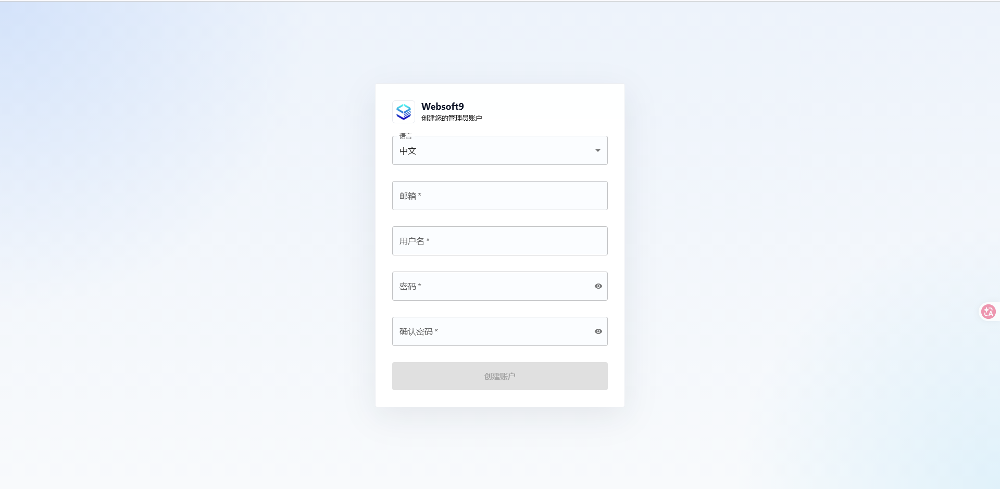
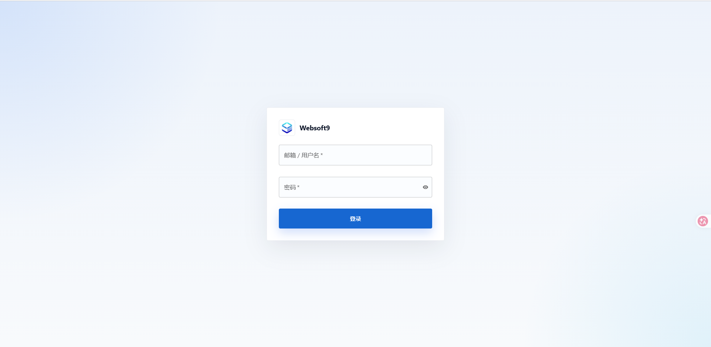
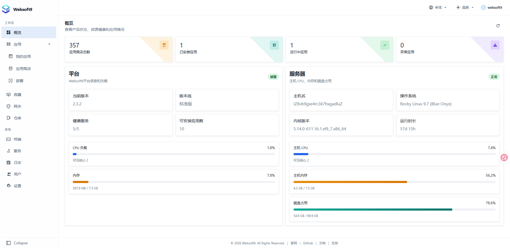

# 登录 Websoft9 控制台

在成功[安装](./install) Websoft9 后，即可登录 Websoft9 控制台进行配置和管理。

## 准备

登录之前，请确保完成以下准备工作：

1. **开放服务器安全组入方向端口**：

   - **必要端口**：80, 443, 9000
   - **可选端口**（供应用访问）：9001-9999

## 首次访问

1. 本地浏览器访问： `http://服务器公网IP:9000`
2. 首次访问将进入**设置向导**，根据提示创建管理员账户并完成基本配置
   
3. 设置完成后，使用刚创建的管理员账户登录控制台
   

> Websoft9 使用独立的用户系统，管理员账户在设置向导中创建，与服务器操作系统账号无关。

## 控制台概览

登录成功后进入控制台首页：

左侧导航菜单分为两大区域：

**工作区**
| 菜单 | 功能 |
|------|------|
| 概览 | 服务器状态总览 |
| 应用 › 我的应用 | 管理已安装的应用（启动、停止、重启、重建、备份、编排等） |
| 应用 › 应用商店 | 浏览和安装 200+ 开源应用模板 |
| 应用 › 部署 | 自定义 Docker Compose 部署 |
| 容器 | 管理 Docker 容器和镜像 |
| 网关 | 域名绑定、反向代理和 SSL 证书管理 |
| 仓库 | Git 仓库托管和代码管理 |

**系统**
| 菜单 | 功能 |
|------|------|
| 终端 | 浏览器内 SSH 终端和文件管理 |
| 服务 | 核心服务状态监控 |
| 日志 | 结构化日志查看 |
| 用户 | 多用户账号与角色权限管理 |
| 设置 | 平台参数、镜像加速、证书等全局配置 |

## 相关主题

- [为 Websoft9 设置全局域名](./domain-set#wildcard)
- [使用模板一键部署应用](./appstore-guide)
- [使用程序环境部署应用](./runtime)
- [用户账号与权限](./credentials)
